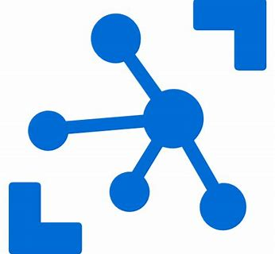

# Azure IoT Hub

Azure IoT Hub is a fully managed service that enables reliable and secure bidirectional communications between millions of IoT devices and a solution back end. Azure IoT Hub:

* Provides multiple device-to-cloud and 
* cloud-to-device communication options. These options include one-way messaging, file transfer, and request-reply methods.
* Provides built-in declarative message routing to other Azure services.
* Provides a queryable store for device metadata and synchronized state information.
* Enables secure communications and access control using per-device security keys or X.509 certificates.
* Provides extensive monitoring for device connectivity and device identity management events.
* Includes device libraries for the most popular languages and platforms.

<iframe src="https://channel9.msdn.com/Shows/Azure-Friday/Azure-IoT-Hub/player" width="480" height="270" allowFullScreen frameBorder="0"></iframe>

## Create IoTHub and Stream Data to IoT Hub

## IoTHub: Connect, monitor, and manage billions of IoT assets

- Establish bi-directional communication with billions of IoT devices
- Authenticate per device for security-enhanced IoT solutions
- Register devices at scale with IoT Hub Device Provisioning Service
- Manage your IoT devices at scale with device management
- Extend the power of the cloud to your edge device

## Create Resource Group

####

#### Create a resource group collect and manage all your application resources for this lab

####

####

#### Click on Create button

####

####

#### Select subscription and region

####

## Create IoThub

####

#### Your device will connect to this IoTHub and start sending data

####

####

#### Make sure you select the resource group you created in previous step

####

## Connect Device and Send Data to IoThub

####

#### This Lab assumes you are using MXChip as the Device

####

####

### Prepare the MXChip by 
- updating firmware
- connecting to Wifi
- connecting to Azure to select a subscription and IoTHub
- uploading device code

####

[Prepare MXChip to Connect to IoTHub](https://docs.microsoft.com/en-us/azure/iot-hub/iot-hub-arduino-iot-devkit-az3166-get-started)

####

### Once Device Connects to IoTHub, messages flow into IoThub

####

## Create Consumer Groups

#### In order to allow several consumer applications to read data from the IoT Hub independently at their own pace a Consumer Group must be configured for each one. 

####

#### Pick your IoTHub, go to Endpoint and Events

####

####

#### Add a new consumer group and save

####

